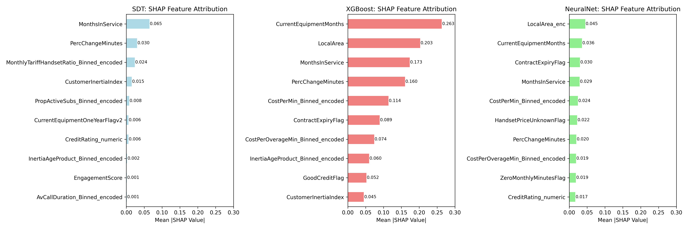
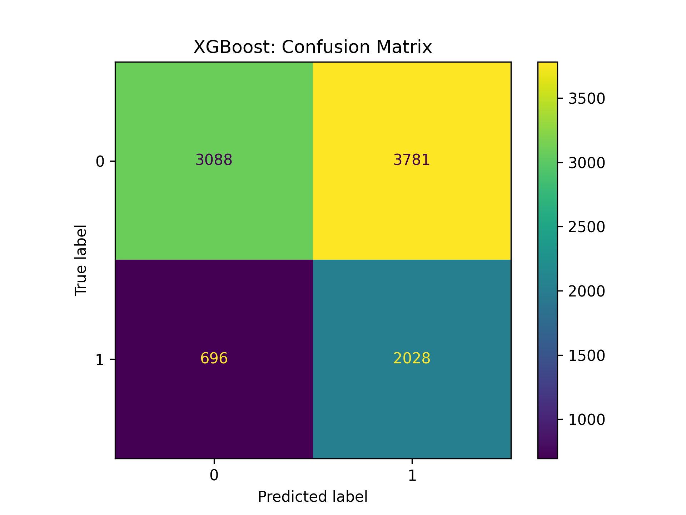

# 🌐 Customer Churn Prediction: Cell2Cell Dataset  

**Libraries:** `scikit-learn`, `matplotlib`, `seaborn`, `XGBoost`, `TensorFlow`, `SHAP` 
**Dataset:** [Cell2Cell Churn Dataset](https://www.kaggle.com/datasets/jpacse/datasets-for-churn-telecom/data)    

In this project, we explore the Cell2Cell dataset and build three supervised machine learning models - **Decision Tree**, **XGBoost**, and a **Neural Network** (TensorFlow) — to predict customer churn risk. The workflow includes feature engineering, model tuning, performance evaluation, and SHAP-based interpretability.  

## 🧠 Analytical Approach
 - **Feature engineering** with tenure, billing, call usage, and derived behavioural indicators
 - **Categorical Optimisation**  via native support in XGBoost and embedding layers in the neural network
 - **Model Evaluation** using accuracy, precision, recall, and $F_1$ score on both validation and test sets
 - **Global Interpretability** through SHAP to compare feature importance across architectures
 - **Confusion Matrix Analysis** to diagnose prediction trade-offs and guide threshold tuning    

## 📊 Results
 - **XGBoost** emerged as the top-performing model, with validation recall of **75.1%** and a stable $F_1$ score of **0.495** on test data
 - **Neural Network** achieved higher validation accuracy but struggled with recall, indicating overfitting to the majority class
 - **SHAP analysis** revealed consistently influential features across models
 - **Confusion matrix analysis** highlighted a recall-focused strategy: most churners were correctly flagged, though false positives remained substantial

## 🔮 Next Steps
 - Refine the Neural Network with dropout, class weighting, and early stopping to improve recall
 - Extend SHAP analysis

📖 Jupyter Notebook: [GitHub](notebooks/cell2cell_customer_churn_v1.ipynb) | [CoLab](https://colab.research.google.com/drive/19w02yTrKmPHFSv-OwqHzBjbYtv3l_t-N)  

 
  

